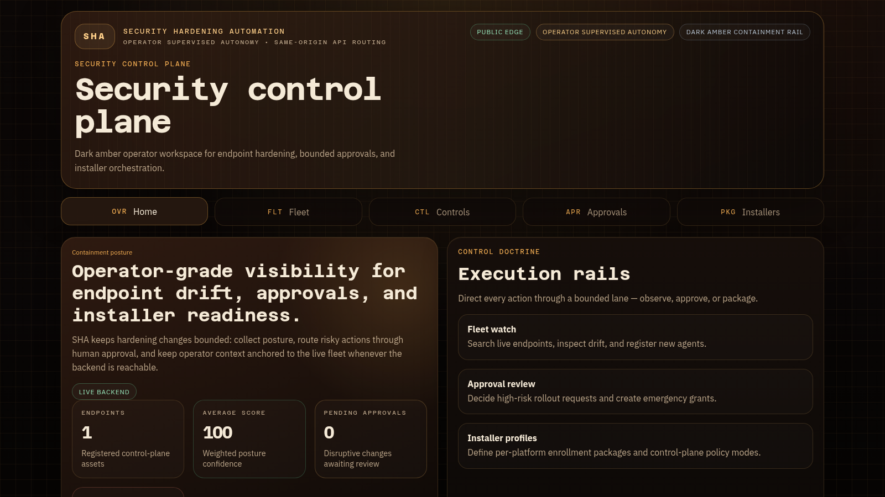

# SHA — Security Hardening Automation

SHA is an early-stage Windows/Linux/macOS security hardening automation platform. It combines a FastAPI control-plane API, a Next.js operator dashboard, deterministic installer-profile artifacts, and shared agent contracts for endpoint enrollment, posture reporting, approvals, and bounded remediation workflows.

The project goal is practical hardening without casually breaking endpoints: observe posture, rank gaps, require human approval for disruptive actions, and keep all endpoint work constrained to typed hardening capabilities rather than arbitrary remote shell access.

[](https://github.com/elias-leslie/sha/actions/workflows/ci.yml)
[](LICENSE)
[](https://www.python.org/)
[](https://nextjs.org/)



## Current status

This repository contains a working control-plane/dashboard slice, not a production-ready endpoint-management product.

Implemented:

- backend API (8 routers, 17 OpenAPI paths) for enrollment, heartbeats, posture snapshots, installer profiles, approval requests/grants, response actions, source-pack catalog reads, and compliance evidence export
- frontend dashboard pages for fleet, endpoints, controls, installers, and approvals, each with a live/fixture data-source indicator, weighted endpoint posture score, and endpoint response-action trail
- deterministic Linux, Windows, and macOS bootstrap artifact generation for installer profiles, served with `Content-Disposition` and `X-SHA-Artifact-Sha256` integrity headers
- generated Linux, Windows, and macOS reporters poll approval-backed response actions; all complete bounded incident-response context/evidence collection, while Linux and Windows each have a first reversible typed hardening control
- minimal Linux Go endpoint agent path with systemd packaging for enroll, heartbeat, posture upload, response-action polling, evidence reporting, and SSH password-authentication apply/rollback
- optional API token enforcement for control-plane `/api` routes, with generated reporters carrying a least-privilege agent token when configured
- a human-in-the-loop approval workflow with two typed request kinds (`hardening_change`, `elevated_troubleshooting`), bounded grant TTLs (15–240 min), manual emergency grants, append-only audit events, and concurrency-safe state transitions
- an approval-backed response-action queue for dispatching typed agent work and reporting execution results without arbitrary remote shell access
- 22 generated JSON Schemas under `schemas/generated/`, exported deterministically from the Pydantic contracts
- 4 curated starter control packs (17 controls) spanning public-source NIST SP 800-53 Rev. 5, DISA Windows Server 2022 STIG, CISA/NSA hardening guidance, and SHA's implemented endpoint-response controls, built by a strict, repo-local, deterministic catalog builder
- HA-ready self-hosting compose stack with PostgreSQL, two backend replicas, nginx API load balancing, and the dashboard

Not yet production-ready:

- no full multi-user authentication or SSO layer; built-in auth is limited to operator and least-privilege agent API tokens
- no packaged cross-platform privileged Go endpoint service yet; the checked-in Go agent currently covers the Linux SSH-hardening path
- no fully managed production HA offering; a starter PostgreSQL/nginx compose path is checked in for HA-ready self-hosting
- no live AI/operator integration is required or bundled

Do not expose the backend or dashboard to an untrusted network without enabling token protection or stronger external authentication, authorization, TLS, and deployment hardening appropriate for your environment.

## What the bootstrap reporters actually check

The generated installer artifacts are not just stubs — each one installs a small reporter (a systemd timer on Linux, a scheduled task on Windows, or a launchd daemon on macOS, all on a 15-minute cadence) that runs concrete posture checks and reports back through the full `enroll → heartbeat → posture-snapshot` cycle:

- **Linux** — firewall service active (ufw / firewalld / nftables), SSH `PasswordAuthentication`, root password lock, automatic-update units, audit/log-retention signal, bounded hardware summary, process inventory, package inventory, enabled startup services, active login sessions, and listening-port inventory.
- **Windows** — all firewall profiles enabled, Microsoft Defender real-time protection, BitLocker system-drive protection, Secure Boot, process inventory, TCP listener inventory, installed software names, automatic-start services, recent Security log readability, service status, and current service identity.
- **macOS** — Application Firewall, FileVault, Gatekeeper, automatic-update check preference, unified-log store signal, bounded hardware summary, process inventory, application inventory, launchd startup items, active login sessions, listening TCP sockets, service status, and console-user identity context.

The reporters avoid arbitrary endpoint control by construction: Windows can apply/rollback firewall all-profiles enablement, Defender real-time protection, and host-based endpoint network isolation; Linux can apply/rollback SSH `PasswordAuthentication no` and host-based endpoint network isolation; and macOS currently stays observe-only for hardening mutations. Typed approvals and rollback artifacts gate the reversible Linux/Windows actions. Posture results roll up into a per-endpoint weighted score and a control "drift matrix" on the dashboard.

## Safety model

- **Typed, bounded approvals** — every approval path rejects mixed hardening + troubleshooting, forbids actions outside the typed enums, and bounds elevated troubleshooting to six named scopes. There is no shell or arbitrary-command endpoint anywhere in the API.
- **Deterministic, provenance-pinned controls** — the catalog builder validates each pack against a pinned spec, rejects unexpected, missing, or symlinked files, enforces unique/sorted IDs, and writes atomically. Every control carries provenance and NIST CSF / SP 800-53 / STIG / CISA compliance mappings.
- **Installer policy modes** — profiles select `observe`, `safe_auto`, or `approval_required`, on a `stable` or `preview` channel.

## How it compares

Most hardening tools sit at one of two extremes. **Auditors** (Lynis, OpenSCAP
scans) only report — you fix everything by hand. **Appliers** (ansible-lockdown,
OpenSCAP remediation, Wazuh active response) push changes, or run arbitrary
remote shell, with nothing between *detected* and *changed*.

SHA's design splits the difference: posture is observed and gaps are ranked, but
every disruptive action is a **typed hardening capability behind a mandatory
human-approval gate** — never arbitrary remote shell. The control plane,
dashboard, approval flow, and posture/enrollment API are implemented today; the
privileged endpoint agent that executes approved capabilities is contract-defined
and still in progress (see [Current status](#current-status)).

| | SHA | Lynis | OpenSCAP · ansible-lockdown | Wazuh |
|---|:---:|:---:|:---:|:---:|
| Reports posture vs. public benchmarks | ✅ | ✅ | ✅ | ✅ |
| Changes endpoints, not just audits | ✅ by design | audit only | ✅ | active response |
| Disruptive actions gated on human approval | ✅ | n/a | ❌ applies directly | ❌ |
| Endpoint work limited to typed capabilities (no arbitrary shell) | ✅ | n/a | playbooks/scripts | ❌ arbitrary commands |
| Operator dashboard + approval queue | ✅ | ❌ | ❌ | ✅ |

The differentiator isn't the control content — NIST, DISA, and CISA/NSA guidance
is public and everyone ships it. It's the **execution model**: bounded, typed,
and approval-gated by default.

> ⭐ If a gated, typed approach to hardening is what you've wanted, a star helps others find it.

## Requirements

- Python 3.13
- [uv](https://docs.astral.sh/uv/) for backend dependency management
- Node.js 24 or newer
- [pnpm](https://pnpm.io/) 10.28.0 via Corepack

Optional Ubuntu 24.04 prerequisite bootstrap:

```bash
sudo apt-get update
sudo apt-get install -y ca-certificates curl git

curl -LsSf https://astral.sh/uv/install.sh | sh
export PATH="$HOME/.local/bin:$PATH"
uv python install 3.13

curl -fsSL https://deb.nodesource.com/setup_24.x | sudo -E bash -
sudo apt-get install -y nodejs
sudo corepack enable pnpm
sudo corepack prepare pnpm@10.28.0 --activate
```

## Install from a fresh clone

```bash
git clone https://github.com/elias-leslie/sha.git
cd sha

cd backend
uv sync

cd ../frontend
pnpm install
```

## Configuration

Use `.env.example` as a local environment template:

```bash
cp .env.example .env
# Optional: load it into the current shell before starting commands.
set -a; . ./.env; set +a
```

Backend settings use the `SHA_` prefix:

- `SHA_DATABASE_URL` — defaults to `sqlite:///data/sha.sqlite3` when run from `backend/`
- `SHA_PORT` — documented local backend port, default `8010`
- `SHA_API_TOKEN` — optional bearer/API token; when set, all `/api/*` routes require `Authorization: Bearer <token>` or `X-SHA-API-Token`
- `SHA_AGENT_API_TOKEN` — optional least-privilege token embedded in generated reporters; it can only enroll, heartbeat, post posture, fetch assigned response actions, and report action results

Frontend settings:

- `API_URL` — backend origin used by Next.js rewrites, default `http://127.0.0.1:8010`
- `NEXT_PUBLIC_SHA_API_TOKEN` — optional lab/operator token sent with frontend API requests when `SHA_API_TOKEN` is enabled

Optional operator/agentic automation concepts such as SHAna are documented as product direction only. The checked-in app runs without private agent infrastructure or external AI credentials.

## Run locally

Terminal 1:

```bash
cd backend
uv run uvicorn app.main:app --host 127.0.0.1 --port 8010
```

Terminal 2:

```bash
cd frontend
API_URL=http://127.0.0.1:8010 pnpm dev --port 3010
```

Then open <http://127.0.0.1:3010>.

Health check:

```bash
curl http://127.0.0.1:8010/health
```

The frontend has typed fixture fallbacks for dashboard views, so most pages still render if the backend is absent. Mutating/API-backed flows require the backend.

## Test, typecheck, and build

Backend:

```bash
cd backend
uv run pytest
uv run python scripts/build_source_catalog.py
uv run python scripts/export_contract_schemas.py
```

Frontend:

```bash
cd frontend
pnpm test
pnpm exec tsc --noEmit
pnpm build
```

## Runtime smoke test

With the backend running:

```bash
curl http://127.0.0.1:8010/health
curl http://127.0.0.1:8010/api/endpoints
curl http://127.0.0.1:8010/api/source-packs
```

With both backend and frontend running:

```bash
curl -I http://127.0.0.1:3010/
curl http://127.0.0.1:3010/health
```

## Architecture

- `backend/` — FastAPI control-plane API, SQLite-backed local store, installer artifact renderer, source-pack catalog builder, and contract schema exporter
- `frontend/` — Next.js operator dashboard with local fixture fallback behavior
- `agent/` — contract documentation for the future privileged endpoint agent
- `schemas/generated/` — JSON Schema exports for API request/response contracts
- `control-packs/` — curated starter control-pack inputs and generated catalog manifest
- `docs/architecture/` — architecture and approval-boundary notes
- `scripts/` — optional systemd/Caddy/cloudflared deployment helpers using placeholder hosts by default

## Control-pack provenance

Checked-in starter controls use a fresh `control.public.*` ID scheme and cite public-source materials:

- NIST SP 800-53 Rev. 5 / OSCAL catalog
- DISA Microsoft Windows Server 2022 STIG V2R5
- CISA/NSA Enhanced Visibility and Hardening Guidance for Communications Infrastructure

CIS Benchmark and Microsoft baseline content are not reproduced in this repository. Future integrations should use citation-only references unless licensing permits checked-in content.

## License

Apache License 2.0. See [LICENSE](LICENSE) and [NOTICE](NOTICE).
