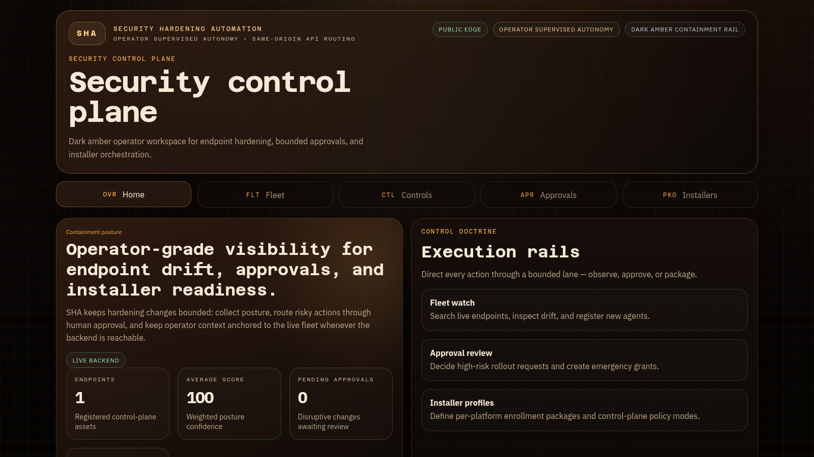

# SHA — Security Hardening Automation

SHA is an early-stage Windows/Linux/macOS security hardening automation platform. It combines a FastAPI control-plane API, a Next.js operator dashboard, a Go endpoint agent, compatibility bootstrap reporters, and shared contracts for enrollment, posture reporting, approvals, and bounded remediation workflows.

The project goal is practical hardening without casually breaking endpoints: observe posture, rank gaps, require human approval for disruptive actions, and keep all endpoint work constrained to typed hardening capabilities rather than arbitrary remote shell access.

[](https://github.com/elias-leslie/sha/actions/workflows/ci.yml)
[](LICENSE)
[](https://www.python.org/)
[](https://nextjs.org/)



## Current status

This repository contains a working control-plane/dashboard slice, not a production-ready endpoint-management product.

Implemented:

- backend API (9 routers, 19 OpenAPI paths) for enrollment, heartbeats, posture snapshots, the canonical control registry, installer profiles, approval requests/grants, leased response actions, source-pack catalog reads, and compliance evidence export
- frontend dashboard pages for fleet, endpoints, controls, installers, and approvals, with live/loading/error state, an explicitly enabled fixture-only demo mode, weighted endpoint posture scores, and endpoint response-action history
- deterministic Linux, Windows, and macOS compatibility reporter generation for installer profiles, served as private, non-cacheable downloads with attachment, digest, no-sniff, and no-referrer headers; token-bearing bodies are not previewed in the dashboard
- generated Linux, Windows, and macOS reporters atomically claim approval-backed response actions under short leases; all complete bounded incident-response context/evidence collection, while Linux and Windows each have reversible typed hardening controls
- cross-compiled Go endpoint agent release path with Linux systemd, macOS launchd, and Windows scheduled-task packaging for enroll, heartbeat, posture upload, leased response-action claim/result, explicit unsupported-action results, and Windows Firewall all-profile apply/rollback; only the Windows Go agent advertises mutation and rollback-artifact support
- fail-closed protected authentication with separate operator, read-only, and agent principals; the local-only `development_open` mode is explicit
- a human-in-the-loop approval workflow with two typed request kinds (`hardening_change`, `elevated_troubleshooting`), bounded grant TTLs (15–240 min), manual emergency grants, append-only audit events, and concurrency-safe state transitions
- an approval-backed response-action queue with request idempotency, atomic claim, opaque hashed lease credentials, expiry/reclaim, and lease-bound idempotent result reporting
- Alembic-managed SQLite/PostgreSQL schemas, including a one-shot migration/check split for the HA deployment
- 24 generated JSON Schemas under `schemas/generated/`, exported deterministically from the Pydantic contracts
- 4 curated starter control packs (17 controls) spanning public-source NIST SP 800-53 Rev. 5, DISA Windows Server 2022 STIG, CISA/NSA hardening guidance, and SHA's implemented endpoint-response controls, built by a strict, repo-local, deterministic catalog builder
- HA-ready self-hosting compose stack with PostgreSQL, two backend replicas, nginx API load balancing, and the dashboard

Not yet production-ready:

- no OIDC browser session or scoped client/location authorization yet; API tokens are the current protected-mode credentials, and trusted external-proxy headers are accepted only on a separately protected direct API path
- no short-lived enrollment tokens, unique per-device credentials, signed packages, or signed bootstrap manifests; generated compatibility reporters use the shared agent token in protected mode and are not production installers
- Linux and Windows privileged runtime have fresh Proxmox evidence in `docs/verification/2026-07-17-phase0-runtime.md`; macOS is build/contract verified only
- no fully managed production HA offering; a starter PostgreSQL/nginx compose path is checked in for HA-ready self-hosting
- no live AI/operator integration is required or bundled

Do not expose the backend or dashboard to an untrusted network without protected authentication, HTTPS, managed secrets, and deployment hardening appropriate for your environment. The compatibility reporter path is transitional, not the signed package/enrollment design described in the roadmap.

## What the compatibility reporters actually check

The generated artifacts install a transitional reporter (a systemd timer on Linux, a scheduled task on Windows, or a launchd daemon on macOS, all on a 15-minute cadence) that runs concrete posture checks and reports back through `enroll → heartbeat → posture snapshot → action claim → lease-bound result`:

- **Linux** — firewall service active (ufw / firewalld / nftables), SSH `PasswordAuthentication`, root password lock, automatic-update units, audit/log-retention signal, bounded hardware summary, process inventory, package inventory, enabled startup services, active login sessions, and listening-port inventory.
- **Windows** — all firewall profiles enabled, Microsoft Defender real-time protection, BitLocker system-drive protection, Secure Boot, process inventory, TCP listener inventory, installed software names, automatic-start services, recent Security log readability, service status, and current service identity.
- **macOS** — Application Firewall, FileVault, Gatekeeper, automatic-update check preference, unified-log store signal, bounded hardware summary, process inventory, application inventory, launchd startup items, active login sessions, listening TCP sockets, service status, and console-user identity context.

The reporters avoid arbitrary endpoint control by construction: Windows can apply/rollback firewall all-profiles enablement, Defender real-time protection, and host-based endpoint network isolation; Linux can apply/rollback SSH `PasswordAuthentication no` and host-based endpoint network isolation; and macOS currently stays observe-only for hardening mutations. Typed approvals and rollback artifacts gate the reversible Linux/Windows actions. Posture results roll up into a per-endpoint weighted score and a control "drift matrix" on the dashboard.

These downloads are deterministic compatibility scripts, not signed production packages. In protected mode they contain the shared agent token, so the API marks them `private, no-store`, the dashboard never renders their body, and operators should save, hash-check, inspect, then execute the local file. Never pipe a network response directly into a privileged shell.

## Safety model

- **Typed, bounded approvals** — every approval path rejects mixed hardening + troubleshooting, forbids actions outside the typed enums, and bounds elevated troubleshooting to six named scopes. There is no shell or arbitrary-command endpoint anywhere in the API.
- **Principal-separated access** — operator, read-only, and agent credentials have exclusive route classes. Audit actors come from the authenticated principal; caller-supplied actor fields are ignored.
- **Lease-bound delivery** — agents atomically claim at most one action, receive an opaque lease token once, and must submit results before that lease expires. Stale or mismatched completions cannot overwrite the active attempt.
- **Deterministic, provenance-pinned controls** — the catalog builder validates each pack against a pinned spec, rejects unexpected, missing, or symlinked files, enforces unique/sorted IDs, and writes atomically. Every control carries provenance and NIST CSF / SP 800-53 / STIG / CISA compliance mappings.
- **Installer policy modes** — profiles select `observe`, `safe_auto`, or `approval_required`, on a `stable` or `preview` channel.

## How it compares

Most hardening tools sit at one of two extremes. **Auditors** (Lynis, OpenSCAP
scans) only report — you fix everything by hand. **Appliers** (ansible-lockdown,
OpenSCAP remediation, Wazuh active response) push changes, or run arbitrary
remote shell, with nothing between *detected* and *changed*.

SHA's design splits the difference: posture is observed and gaps are ranked, but
every disruptive action is a **typed hardening capability behind a mandatory
human-approval gate** — never arbitrary remote shell. The control plane,
dashboard, approval flow, leased action delivery, compatibility reporters, and a
narrow cross-platform Go agent exist today; production identity, enrollment,
package trust, and broader endpoint capabilities remain roadmap work (see
[Current status](#current-status)).

| | SHA | Lynis | OpenSCAP · ansible-lockdown | Wazuh |
|---|:---:|:---:|:---:|:---:|
| Reports posture vs. public benchmarks | ✅ | ✅ | ✅ | ✅ |
| Changes endpoints, not just audits | ✅ by design | audit only | ✅ | active response |
| Disruptive actions gated on human approval | ✅ | n/a | ❌ applies directly | ❌ |
| Endpoint work limited to typed capabilities (no arbitrary shell) | ✅ | n/a | playbooks/scripts | ❌ arbitrary commands |
| Operator dashboard + approval queue | ✅ | ❌ | ❌ | ✅ |

The differentiator isn't the control content — NIST, DISA, and CISA/NSA guidance
is public and everyone ships it. It's the **execution model**: bounded, typed,
and approval-gated by default.

> ⭐ If a gated, typed approach to hardening is what you've wanted, a star helps others find it.

## Requirements

- Python 3.13
- [uv](https://docs.astral.sh/uv/) for backend dependency management
- Node.js 24 or newer
- [pnpm](https://pnpm.io/) 10.28.0 via Corepack

Optional Ubuntu 24.04 prerequisite bootstrap:

```bash
sudo apt-get update
sudo apt-get install -y ca-certificates git
```

Install `uv` and Node.js 24 from the vendor documentation linked above, then enable the pinned package manager:

```bash
sudo corepack enable pnpm
sudo corepack prepare pnpm@10.28.0 --activate
```

## Install from a fresh clone

```bash
git clone https://github.com/elias-leslie/sha.git
cd sha

cd backend
uv sync

cd ../frontend
pnpm install
```

## Configuration

Use `.env.example` as a local environment template:

```bash
cp .env.example .env
# Optional: load it into the current shell before starting commands.
set -a; . ./.env; set +a
```

Backend settings use the `SHA_` prefix:

- `SHA_DATABASE_URL` — defaults to `sqlite:///data/sha.sqlite3` when run from `backend/`
- `SHA_DATABASE_URL_FILE` — optional file-mounted secret alternative to `SHA_DATABASE_URL`
- `SHA_AUTH_MODE` — `development_open` for local development or `protected` for shared deployments; protected mode returns 503 if no authentication mechanism is configured
- `SHA_DATABASE_MIGRATION_MODE` — `upgrade` for local/one-shot migration or `check` for API replicas that must already be at Alembic head
- `SHA_PORT` — documented local backend port, default `8010`
- `SHA_API_TOKEN` — operator credential for non-agent API routes; accepts `Authorization: Bearer <token>` or `X-SHA-API-Token`
- `SHA_API_TOKEN_FILE` — optional file-mounted secret alternative to `SHA_API_TOKEN`
- `SHA_READONLY_API_TOKEN` — read-only credential for safe GET/HEAD/OPTIONS API routes; blocked from agent routes, mutations, and installer artifact downloads
- `SHA_READONLY_API_TOKEN_FILE` — optional file-mounted secret alternative to `SHA_READONLY_API_TOKEN`
- `SHA_AGENT_API_TOKEN` — least-privilege credential embedded in generated compatibility reporters; required for artifact generation whenever operator API-token or external-proxy authentication is configured. It can only enroll, heartbeat, post posture, claim an endpoint action, and report its lease-bound result. Unauthenticated local mode can leave it unset and generate tokenless artifacts.
- `SHA_AGENT_API_TOKEN_FILE` — optional file-mounted secret alternative to `SHA_AGENT_API_TOKEN`
- `SHA_EXTERNAL_AUTH_TRUSTED_TOKEN` — optional shared secret for a trusted identity proxy; direct requests must include `X-SHA-External-Auth`, `X-SHA-External-Role: operator|readonly`, and a non-empty `X-SHA-External-User`. Only use this when the backend is reachable solely through that proxy.
- `SHA_EXTERNAL_AUTH_TRUSTED_TOKEN_FILE` — optional file-mounted secret alternative to `SHA_EXTERNAL_AUTH_TRUSTED_TOKEN`

Frontend settings:

- `API_URL` — backend origin used by the Next.js same-origin API proxy, default `http://127.0.0.1:8010`
- `NEXT_PUBLIC_SHA_DEMO_MODE` — build-time fixture-only mode; defaults off, visibly labels fixture data, and disables mutations

The stock frontend forwards caller authorization, strips every caller-supplied `X-SHA-External-*` header, does not follow credentialed redirects, and has no ambient operator token. Trusted-proxy headers therefore require a separate protected direct API ingress or a future session adapter; they cannot be smuggled through the stock browser proxy.

Optional operator/agentic automation concepts such as SHAna are documented as product direction only. The checked-in app runs without private agent infrastructure or external AI credentials.

## Run locally

Terminal 1:

```bash
cd backend
uv run uvicorn app.main:app --host 127.0.0.1 --port 8010
```

Terminal 2:

```bash
cd frontend
API_URL=http://127.0.0.1:8010 pnpm dev --port 3010
```

Then open <http://127.0.0.1:3010>.

Health check:

```bash
curl http://127.0.0.1:8010/health
```

Normal mode uses only the live API and shows loading/error/empty state when it is unavailable. Fixture data appears only when `NEXT_PUBLIC_SHA_DEMO_MODE=true`; demo mode is visibly labeled and mutations stay disabled.

## Test, typecheck, and build

Backend:

```bash
cd backend
uv run pytest
uv run python scripts/build_source_catalog.py
uv run python scripts/export_contract_schemas.py
```

Frontend:

```bash
cd frontend
pnpm test
pnpm exec tsc --noEmit
pnpm build
```

Linux installer/systemd endpoint E2E fallback when Proxmox is unavailable:

```bash
scripts/test-linux-installer-docker.sh
```

Windows installer/firewall rollback E2E fallback when Proxmox is unavailable:

```bash
scripts/test-windows-installer-qemu.sh
```

macOS installer and Go-agent observe-only E2E on a disposable macOS host or GitHub-hosted macOS runner:

```bash
scripts/test-macos-installer-local.sh
```

HA compose deployment E2E:

```bash
scripts/test-ha-compose.sh
```

HA PostgreSQL backup/restore:

Export the same `POSTGRES_PASSWORD`, `SHA_API_TOKEN`, `SHA_READONLY_API_TOKEN`, and `SHA_AGENT_API_TOKEN` values used by the running stack before invoking these commands. Backup and restore have no fallback credentials. `SHA_COMPOSE_FILES` is required and must list, in launch order, the exact compose files for the deployment as a colon-separated string. This prevents restore from silently dropping a TLS or file-secret overlay.

```bash
export SHA_COMPOSE_FILES="$PWD/deploy/ha/docker-compose.yml"
PROJECT=ha scripts/backup-ha-postgres.sh
# Restore verifies backups/<dump>.sha256 before contacting Docker; set SHA_FILE only for a non-default sidecar path.
CONFIRM_RESTORE=sha-restore PROJECT=ha scripts/restore-ha-postgres.sh backups/sha-postgres-YYYYmmddHHMMSS.dump
```

For TLS, use `SHA_COMPOSE_FILES="$PWD/deploy/ha/docker-compose.yml:$PWD/deploy/ha/docker-compose.tls.yml"` and preserve `SHA_TLS_CERT_DIR` and `SHA_TLS_PORT`. For file-secret deployments, select `docker-compose.secrets.yml` instead and preserve every `*_SECRET_FILE` path plus the same base-file interpolation values used at launch. Backups default to the ignored, Docker-excluded `backups/` directory with mode 0700; dump and digest files use mode 0600.

HA TLS E2E:

```bash
scripts/test-ha-compose-tls.sh
```

HA file-secret E2E:

```bash
scripts/test-ha-compose-secrets.sh
```

## Runtime smoke test

With the backend running:

```bash
curl http://127.0.0.1:8010/health
curl http://127.0.0.1:8010/api/endpoints
curl http://127.0.0.1:8010/api/source-packs
```

With both backend and frontend running:

```bash
curl -I http://127.0.0.1:3010/
curl http://127.0.0.1:3010/health
```

## Architecture

- `backend/` — FastAPI control-plane API, Alembic-managed SQLite/PostgreSQL persistence, compatibility artifact renderer, source-pack catalog builder, and contract schema exporter
- `frontend/` — Next.js operator dashboard with live API state and explicit fixture-only demo mode
- `agent/` — Go endpoint agent plus its typed execution contract
- `schemas/generated/` — JSON Schema exports for API request/response contracts
- `control-packs/` — curated starter control-pack inputs and generated catalog manifest
- `docs/architecture/` — architecture and approval-boundary notes
- `scripts/` — optional systemd/Caddy/cloudflared deployment helpers using placeholder hosts by default

## Control-pack provenance

Checked-in starter controls use a fresh `control.public.*` ID scheme and cite public-source materials:

- NIST SP 800-53 Rev. 5 / OSCAL catalog
- DISA Microsoft Windows Server 2022 STIG V2R5
- CISA/NSA Enhanced Visibility and Hardening Guidance for Communications Infrastructure

CIS Benchmark and Microsoft baseline content are not reproduced in this repository. Future integrations should use citation-only references unless licensing permits checked-in content.

## License

Apache License 2.0. See [LICENSE](LICENSE) and [NOTICE](NOTICE).
